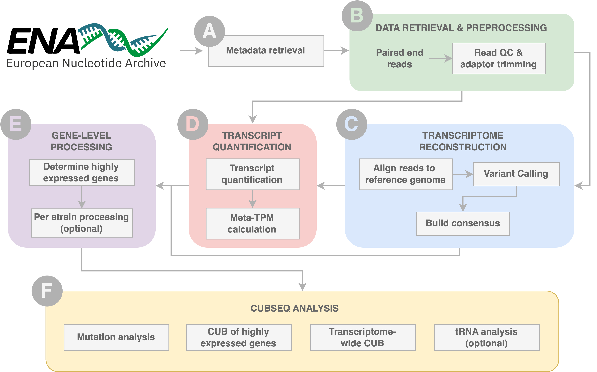

# cubseq-nf


## What is CUBseq?
Codon Usage Bias from RNA-sequencing data (CUBseq) is a fully automatic 
pipeline that produces robust estimates of codon usage frequencies at 
the transcriptome level. CUBseq can be used for any organism with an 
NCBI taxonomy ID, available RNA-sequencing data and a reference 
genome/annotation. The end result is a dataset of transcriptome-wide 
sequences with variants built in, allowing CUBseq to provide codon 
relative frequencies as well as raw counts at codon and amino acid 
resolution for custom downstream codon usage analysis.

### What can CUBseq be used for?
- Large-scale transcriptome-wide codon usage analysis.
- Generation of transcriptome-derived codon usage tables (expressed as 
relative frequency and frequency per thousand).
- Quantification of transcriptome-wide genes.
- Robust identification of high expression genes.
- Reconstruction of transcriptomes per sample using variant calls.
- Analysis of mutation frequency per sample across the transcriptome 
and at gene level.
- Comparison of codon frequency with tRNA abundance.



## Running CUBseq: quick-guide

> [!NOTE] 
> Before running the workflow, you will need to have Nextflow 
installed. See instructions on how to [here](https://www.nextflow.io/docs/latest/getstarted.html#installation).


### Install or update the workflow

```bash
nextflow pull stracquadaniolab/cubseq-nf
```

### Run the analysis

```bash
nextflow run stracquadaniolab/cubseq-nf
```

## Configuring CUBseq

To run CUBseq you will need to specify a number of paths for storing 
results, and provide appropriate parameter options based on the 
organism being analysed. Required parameters are indicated with an 
asterisk, the rest of the parameters are optional.


| Parameter    | Description |
| :----------- | :------- |
| `resultsDir` | Directory where all results are stored [default: `"./results/"`]. |
| Paths to genome files |
| `genome.reference` * | Path to genome reference (fasta) file [example: `"data/genome/ecoli.fa"`]. |
| `genome.annotation` * | Path to genome annotation (GTF/GFF/GFF3) file [example: `"data/genome/ecoli.gff"`]. |
| ENA metadata retrieval parameters | |
| `taxonId` * | NCBI taxonomy ID of organism to be analysed [default: `"562"`]. |
| `limitSearch` | Limit number of records output from ENA search query [default: `0`]. |
| `removeRun` | Remove run by specifying its run accession [default: `"NULL"`, example: `"SRR13894889"`]. |
| `max_sra_bytes` | Specify runs to remove if they exceed size of sra_bytes [default: `"55000000000"`]. |
| `dateMin` | Set minimum date (YYYY/MM/DD) to filter runs by (inclusive) [default: `"1950-01-01"`]. |
| `dateMax` | Set maximum date (YYYY/MM/DD) to filter runs by (inclusive), uses current date by default [default: `"FALSE"`]. |
| STAR align parameters | |
| `star.sjdbOverhang` | The "--sjdbOverhang" option of STAR, specifies length of genomic sequence on each side of the junctions, refer to STAR documentation for more detail. Here, we use STAR's default option [default: `"100"`]. |
| `star.genomeSAindexNbases` * | The "--genomeSAindexNbases" option of STAR, specifying the length (bases) of SA pre-indexing string. This must be scaled down for small genomes, using formula: min(14, log2(GenomeLength)/2 - 1). [default: `"10"`]. |
| `star.alignIntronMax` | The "--alignIntronMax" option of STAR, specifying maximum intron size [default: `"1"`.] |
| `star.limitBAMsortRAM` | The "--limitBAMsortRAM" option of STAR, specifying maximum available RAM (bytes) [default: `"2342750981"`]. |
| `star.outBAMsortingBinsN` | The "--outBAMsortingBinsN" option of STAR, specifying the number of genome bins for coordinate-sorting [default: `"50"`]. |
| featureCounts parameters | |
| `featureCounts.type.feature` | The "-t" option of featureCounts, specifying feature type(s) in a GTF annotation to be used for read mapping. Multiple types should be separated by "," with no space in between [default: `"exon"`]. |
| `featureCounts.type.attribute` | The "-g" option of featureCounts, specifying attribute type in the GTF annotation [default" `"gene_id"`]. |
| Freebayes parameters | |
| `freebayes.ploidy` * | The "--ploidy" option of Freebayes, specifying the default ploidy for the organism used in the analysis. [default: `"1"`]. |
| `freebayes.args` | Additional Freebayes arguments, refer to their documentation [default: ""]. |
| bcftools parameters | |
| `bcftools.filter_vcf.args` | Additional bcftools filter arguments for filtering the VCF file, refer to their documentation [default: `'QUAL>20 && TYPE="snp"'`, note the use of quotation marks here]. |
| Salmon indexing parameters | |
| `salmon.index.args` | Additional arguments for salmon indexing, refer to their documentation [default: ""]. |
| Salmon quantification parameters | |
| `salmon.quant.libtype` | The "--libType" option of Salmon quant, specifying library type, CUBseq sets this to "Automatic" detection by default. Refer to their documentation for more information [default: `"A"`]. |
| `salmon.quant.args` | Additional arguments for salmon quant, refer to their documentation [example: `"--writeUnmappedNames"`]. |
| tximport parameters | |
| `summarize_to_gene. counts_from_abundance` | Generate counts from abundances in tximport [default: `"no"`]. |

## CUBseq results

CUBseq results are stored in the following directories:

- `results/metadata/metadata.csv`: file containing the ENA metadata of RNA sequencing runs.
- `results/bams/`: directory containing the bam files, as processed by STAR.
- `results/featureCounts/` : directory containing featureCounts gene quantification results per sample and summary statistics.
- `results/freebayes-vcf/` : directory containing vcf files, as processed by Freebayes.
- `results/vcf/` : directory containing filtered vcf files, as processed by bcftools norm and bcftools filter.
- `results/transcriptome-consensus/` : directory containing consensus transcriptomes in fasta format.
- `results/wt-transcriptome/` : directory containing the wild-type transcriptome, as generated by gffread.
- `results/mut-transcriptome/` : directory containing the reconstructed mutated transcriptomes per sequencing run, as processed by gffread.
- `results/salmon-quant/` : directory containing gene abundance results per sequencing run, as processed by salmon quantification.
- `results/dataset/` : directory containing the tximport RDS file that sumamrises salmon quantification results at the gene-level (expressed as TPM matrix).
- `results/gene-rank-analysis/` : directory containing results of CUBseq's gene rank analysis.
- `results/heg-mut-transcriptome/` : directory of fasta files per sequencing run, containing only highly expressed genes.
- `results/protein-mut-transcriptome/` : directory of fasta files per sequencing run, containing transcriptome-wide (i.e. all protein-coding) gemes.
- `results/cu-data/` : directory containing codon usage count data for highly expressed genes, protein coding genes, as well as from the Kazusa and CoCoPUTs databases (if available).
- `results/summarise-codon-counts/` : directory containing codon counts summarised at codon and amino acid resolution.

## Authors

- Anima Sutradhar (A.Sutradhar@sms.ed.ac.uk): developer and maintainer.
- Giovanni Stracquadanio (giovanni.stracquadanio@ed.ac.uk): principal investigator.

## Contact us about CUBseq
If you have any questions, issues or feature requests, please get in 
touch using the emails above or posting an Issue.